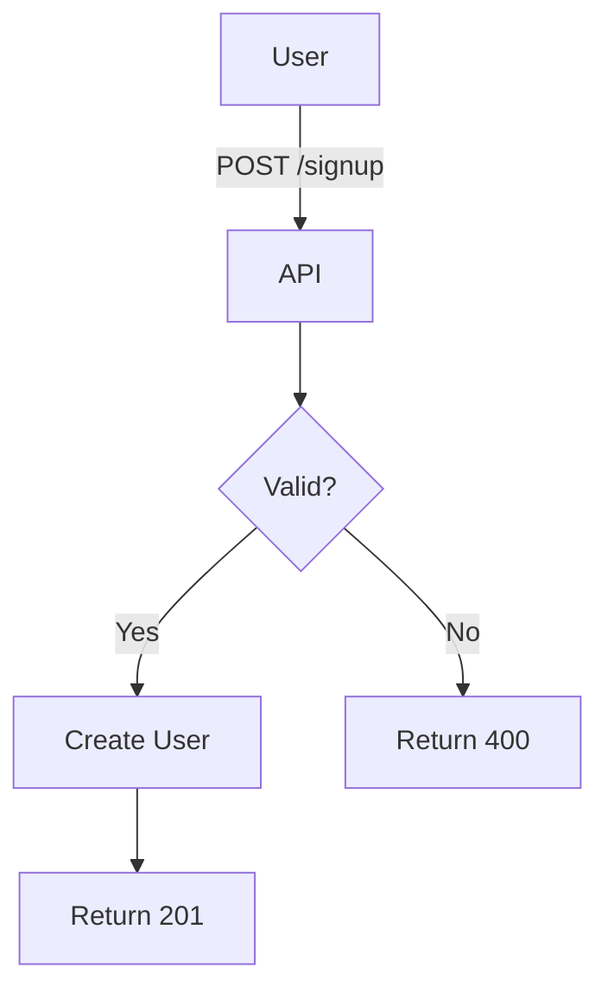

# Documentation Extras — Comments, Diagrams, Tools, Examples

**Version:** 1.0
**Last Updated:** 2026-05-10
**Status:** Active

Supplementary documentation conventions: code comment style, visual aids, validation tooling, and good/bad documentation examples. Companion to `.claude/rules/documentation.md` (core rules) and `.claude/rules/documentation-templates.md` (artifact templates).

---

## 1. Code Comments

### 1.1 When to Comment

**DO comment:**
- ✅ Complex algorithms or business logic
- ✅ Non-obvious decisions ("Why" not "What")
- ✅ Workarounds or temporary solutions
- ✅ Public API functions (JSDoc/TSDoc)
- ✅ Regular expressions
- ✅ Configuration values with impact

**DON'T comment:**
- ❌ Obvious code (`x = x + 1; // increment x`)
- ❌ Bad code (refactor it instead)
- ❌ Outdated comments (keep them updated or remove)

### 1.2 Comment Style

**TypeScript/JavaScript (JSDoc):**
```typescript
/**
 * Calculate total price with tax.
 *
 * @param basePrice - Price before tax in dollars
 * @param taxRate - Tax rate as decimal (e.g., 0.08 for 8%)
 * @returns Total price including tax, rounded to 2 decimals
 *
 * @example
 * ```ts
 * calculateTotal(100, 0.08); // Returns 108.00
 * ```
 */
function calculateTotal(basePrice: number, taxRate: number): number {
  return Math.round((basePrice * (1 + taxRate)) * 100) / 100;
}
```

**Inline comments:**
```typescript
// Use binary search for better performance (O(log n) vs O(n))
const index = binarySearch(sortedArray, target);
```

---

## 2. Diagrams and Visual Aids

### 2.1 ASCII Diagrams

**Use ASCII art for:**
- System architecture
- Data flow
- Component relationships
- Database schemas

**Example:**
```
┌─────────────┐         ┌──────────────┐
│   Client    │────────>│   Backend    │
│   (React)   │<────────│  (Node.js)   │
└─────────────┘         └──────┬───────┘
                               │
                               ▼
                        ┌──────────────┐
                        │  PostgreSQL  │
                        └──────────────┘
```

### 2.2 Mermaid Diagrams (Optional)

For complex flows, use Mermaid:



---

## 3. Tools and Validation

### 3.1 Recommended Tools

**Markdown linting:**
```bash
# Install markdownlint
npm install -g markdownlint-cli

# Run linter
markdownlint .project-management/**/*.md
```

**Spell checking:**
```bash
# Install cspell
npm install -g cspell

# Check spelling
cspell "**/*.md"
```

**Line count check:**
```bash
# Check file sizes
wc -l .project-management/input/backlog/*.md
```

### 3.2 Pre-commit Hook (Optional)

```bash
#!/bin/bash
# .git/hooks/pre-commit

# Check documentation file sizes
for file in .project-management/input/backlog/*.md; do
  lines=$(wc -l < "$file")
  if [ "$lines" -gt 200 ]; then
    echo "ERROR: $file exceeds 200 lines ($lines lines)"
    exit 1
  fi
done
```

---

## 4. Good vs Bad Documentation Examples

### 4.1 Good Documentation

✅ **Clear, concise, English:**
```markdown
## User Authentication

The system uses JWT tokens for authentication. After successful login,
the server returns a token valid for 24 hours. The client stores this
token and includes it in the Authorization header for subsequent requests.
```

### 4.2 Bad Documentation

❌ **Vague, mixed language, passive voice:**
```markdown
## Autentifikacija korisnika

Token se koristi za auth. Možda će biti valid 24h ili više, zavisi.
User bi trebalo da ga stavi u header nekako.
```

---

## Related

- `.claude/rules/documentation.md` — core writing rules (language, style, file size, quality checklist)
- `.claude/rules/documentation-templates.md` — artifact templates (user stories, tasks, bugs, API endpoints)
- `.claude/rules/code-quality.md` — SOLID and DRY principles for the code itself

---

**Status:** ✅ Active
