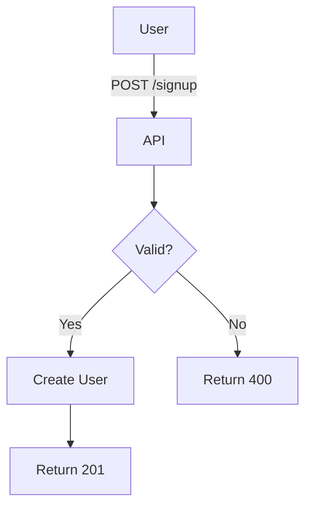

# Documentation Rules

**Version:** 1.0
**Last Updated:** 2026-04-20
**Status:** Active

---

## 1. Language Requirements

### 1.1 Primary Rule: English Only

**ALL documentation MUST be written in English.**

This includes:
- ✅ All `.md` files (README, PRD, technical specs, architecture docs)
- ✅ Code comments (inline comments, docstrings, JSDoc)
- ✅ Commit messages
- ✅ Pull request descriptions
- ✅ Issue descriptions
- ✅ User stories and acceptance criteria
- ✅ Technical tasks descriptions
- ✅ API documentation
- ✅ Inline code examples
- ✅ Error messages in code
- ✅ Log messages
- ✅ Configuration file comments

**Exceptions:**
- ❌ User-facing UI text (use i18n - see I18N-RULES.md)
- ❌ Client communications (use client's language)
- ❌ Translation files (locales/*.json)

### 1.2 Rationale

**Why English only:**
- **International collaboration:** English is the universal language for software development
- **AI/tooling compatibility:** Most AI tools (Claude, Copilot, etc.) work best with English
- **Open source readiness:** Enables broader contribution and usage
- **Professional standard:** Industry best practice
- **Searchability:** Easier to find information using standard English terms
- **Consistency:** Reduces confusion, improves code reviews

---

## 2. File Size Limits

### 2.1 Strict Limits

**All documentation files MUST follow these limits:**

| File Type | Max Lines | Target Lines | Rationale |
|-----------|-----------|--------------|-----------|
| Phase backlog files | **200 lines** | 150-180 | Readability, AI token efficiency |
| README.md (backlog) | **200 lines** | 150 | Quick reference, master index |
| User stories | **50 lines** | 30-40 | Focused, single purpose |
| Technical specs | **600 lines** | 400-500 | Comprehensive but manageable |
| Architecture docs | **600 lines** | 400-500 | Detailed but scannable |
| PRD (Product Req) | **400 lines** | 300-350 | Complete but concise |
| Progress files | **300 lines** | 200-250 | Status tracking |
| Templates | **300 lines** | 200-250 | Reusable patterns |

### 2.2 When to Split Files

**If a file exceeds the limit:**

1. **Phase backlogs (> 200 lines):**
   - Split into sub-phases (e.g., phase-2a, phase-2b)
   - Move lower-priority stories to next phase
   - Move future features to `future.md`

2. **Technical specs (> 600 lines):**
   - Split by component (backend, frontend, infrastructure)
   - Create separate files (e.g., `api-spec.md`, `database-spec.md`)

3. **README files (> 200 lines):**
   - Keep only essential overview
   - Link to detailed docs in separate files

**Example:**
```
Before:
- phase-2-core.md (350 lines) ❌ TOO LARGE

After:
- phase-2a-core-features.md (180 lines) ✅
- phase-2b-integrations.md (170 lines) ✅
```

---

## 3. Writing Style Guidelines

### 3.1 Tone and Voice

**Use:**
- ✅ Clear, concise, professional English
- ✅ Active voice ("Create a user account" not "A user account should be created")
- ✅ Present tense for descriptions ("The system validates..." not "The system will validate...")
- ✅ Imperative mood for instructions ("Run the tests" not "You should run the tests")
- ✅ Technical precision (use exact terms, avoid ambiguity)

**Avoid:**
- ❌ Jargon without explanation
- ❌ Overly casual language ("gonna", "wanna")
- ❌ Ambiguous terms ("soon", "later", "might")
- ❌ Marketing speak ("revolutionary", "game-changing")
- ❌ Passive voice when active is clearer

### 3.2 Structure and Formatting

**Every documentation file MUST include:**

1. **Header with metadata:**
   ```markdown
   # Document Title

   **Version:** 1.0
   **Last Updated:** YYYY-MM-DD
   **Status:** Draft | Active | Deprecated
   ```

2. **Table of contents (if > 100 lines):**
   ```markdown
   ## Table of Contents
   - [Section 1](#section-1)
   - [Section 2](#section-2)
   ```

3. **Clear section hierarchy:**
   - Use `#` for document title
   - Use `##` for main sections
   - Use `###` for subsections
   - Use `####` for sub-subsections (max 4 levels)

4. **Code examples with language tags:**
   ````markdown
   ```typescript
   function example() {
     return "Always specify language";
   }
   ```
   ````

5. **Consistent formatting:**
   - Use `**bold**` for emphasis
   - Use `*italic*` for technical terms on first use
   - Use `code` for inline code, variables, file names
   - Use `> blockquote` for important notes
   - Use `- [ ]` for checklists

---

## 4. Specific Document Types

### 4.1 User Stories (US-XXX)

**Format:**
```markdown
### US-001: Short Descriptive Title
**Priority:** P0 | P1 | P2
**Story:** As a [user type], I want to [action] so that [benefit].

**Acceptance Criteria:**
- [ ] Criterion 1 (testable)
- [ ] Criterion 2 (testable)
- [ ] Criterion 3 (testable)

**Estimate:** X story points
**Dependencies:** US-XXX, T-XXX
**Status:** Todo | In Progress | Completed | Blocked
```

**Rules:**
- Title: Max 50 characters
- Story: Single sentence, clear user value
- Acceptance criteria: 3-7 testable items
- Each criterion starts with a verb
- Use present tense

### 4.2 Technical Tasks (T-XXX)

**Format:**
```markdown
### T-001: Short Task Title
**Priority:** P0 | P1 | P2
**Description:** Brief explanation of what needs to be done.

**Tasks:**
- [ ] Subtask 1
- [ ] Subtask 2
- [ ] Subtask 3

**Estimate:** X story points
**Dependencies:** T-XXX, US-XXX
**Status:** Todo | In Progress | Completed
```

### 4.3 Bug Reports (BUG-XXX)

**Format:**
```markdown
### BUG-001: Short Bug Description
**Priority:** P0 (Critical) | P1 (High) | P2 (Medium)
**Reported:** YYYY-MM-DD
**Reporter:** Name or user ID

**Steps to Reproduce:**
1. Step 1
2. Step 2
3. Step 3

**Expected Result:** What should happen
**Actual Result:** What actually happens
**Environment:** OS, browser, version

**Status:** Open | In Progress | Fixed | Cannot Reproduce
**Fix ETA:** YYYY-MM-DD
```

### 4.4 Commit Messages

**Format:**
```
type: short summary (max 50 chars)

Longer description explaining:
- What changed
- Why it changed
- Any breaking changes
- Related issue/story references

🤖 Generated with [Claude Code](https://claude.com/claude-code)

Co-Authored-By: Claude <noreply@anthropic.com>
```

**Types:**
- `feat:` New feature
- `fix:` Bug fix
- `docs:` Documentation changes
- `chore:` Maintenance (deps, config)
- `refactor:` Code restructuring
- `test:` Test additions/changes
- `perf:` Performance improvements

---

## 5. Code Comments

### 5.1 When to Comment

**DO comment:**
- ✅ Complex algorithms or business logic
- ✅ Non-obvious decisions ("Why" not "What")
- ✅ Workarounds or temporary solutions
- ✅ Public API functions (JSDoc/TSDoc)
- ✅ Regular expressions
- ✅ Configuration values with impact

**DON'T comment:**
- ❌ Obvious code (`x = x + 1; // increment x`)
- ❌ Bad code (refactor it instead)
- ❌ Outdated comments (keep them updated or remove)

### 5.2 Comment Style

**TypeScript/JavaScript (JSDoc):**
```typescript
/**
 * Calculate total price with tax.
 *
 * @param basePrice - Price before tax in dollars
 * @param taxRate - Tax rate as decimal (e.g., 0.08 for 8%)
 * @returns Total price including tax, rounded to 2 decimals
 *
 * @example
 * ```ts
 * calculateTotal(100, 0.08); // Returns 108.00
 * ```
 */
function calculateTotal(basePrice: number, taxRate: number): number {
  return Math.round((basePrice * (1 + taxRate)) * 100) / 100;
}
```

**Inline comments:**
```typescript
// Use binary search for better performance (O(log n) vs O(n))
const index = binarySearch(sortedArray, target);
```

---

## 6. API Documentation

### 6.1 Endpoint Documentation

**Every API endpoint MUST document:**

```markdown
### POST /api/v1/users/signup

**Description:** Create a new user account.

**Authentication:** None (public endpoint)

**Request Body:**
```json
{
  "email": "user@example.com",
  "password": "SecurePass123",
  "name": "John Doe"
}
```

**Response (201 Created):**
```json
{
  "user": {
    "id": "uuid",
    "email": "user@example.com",
    "name": "John Doe"
  },
  "token": "jwt_token_here"
}
```

**Error Responses:**
- `400 Bad Request` - Invalid input (email format, weak password)
- `409 Conflict` - Email already exists
- `500 Internal Server Error` - Server error

**Rate Limiting:** 5 requests per 15 minutes per IP
```

---

## 7. Diagrams and Visual Aids

### 7.1 ASCII Diagrams

**Use ASCII art for:**
- System architecture
- Data flow
- Component relationships
- Database schemas

**Example:**
```
┌─────────────┐         ┌──────────────┐
│   Client    │────────>│   Backend    │
│   (React)   │<────────│  (Node.js)   │
└─────────────┘         └──────┬───────┘
                               │
                               ▼
                        ┌──────────────┐
                        │  PostgreSQL  │
                        └──────────────┘
```

### 7.2 Mermaid Diagrams (Optional)

For complex flows, use Mermaid:



---

## 8. Quality Checklist

**Before committing documentation:**

- [ ] **Language:** All text in English
- [ ] **File size:** Within limits (see section 2.1)
- [ ] **Header:** Includes version, date, status
- [ ] **Grammar:** No typos, proper punctuation
- [ ] **Links:** All internal links work
- [ ] **Code examples:** Syntax-highlighted with language tag
- [ ] **Formatting:** Consistent markdown style
- [ ] **TOC:** Present if file > 100 lines
- [ ] **Readability:** Clear, concise, professional tone
- [ ] **Accuracy:** Technical details verified

---

## 9. Tools and Validation

### 9.1 Recommended Tools

**Markdown linting:**
```bash
# Install markdownlint
npm install -g markdownlint-cli

# Run linter
markdownlint .project-management/**/*.md
```

**Spell checking:**
```bash
# Install cspell
npm install -g cspell

# Check spelling
cspell "**/*.md"
```

**Line count check:**
```bash
# Check file sizes
wc -l .project-management/input/backlog/*.md
```

### 9.2 Pre-commit Hook (Optional)

```bash
#!/bin/bash
# .git/hooks/pre-commit

# Check documentation file sizes
for file in .project-management/input/backlog/*.md; do
  lines=$(wc -l < "$file")
  if [ "$lines" -gt 200 ]; then
    echo "ERROR: $file exceeds 200 lines ($lines lines)"
    exit 1
  fi
done
```

---

## 10. Examples

### 10.1 Good Documentation

✅ **Clear, concise, English:**
```markdown
## User Authentication

The system uses JWT tokens for authentication. After successful login,
the server returns a token valid for 24 hours. The client stores this
token and includes it in the Authorization header for subsequent requests.
```

### 10.2 Bad Documentation

❌ **Vague, mixed language, passive voice:**
```markdown
## Autentifikacija korisnika

Token se koristi za auth. Možda će biti valid 24h ili više, zavisi.
User bi trebalo da ga stavi u header nekako.
```

---

## Summary

**Key Rules:**
1. ✅ **English only** for all documentation
2. ✅ **File size limits** strictly enforced (< 200 lines for backlogs)
3. ✅ **Clear structure** with headers, TOC, metadata
4. ✅ **Professional tone** - active voice, present tense
5. ✅ **Code examples** always syntax-highlighted
6. ✅ **Consistent formatting** across all docs

**Benefits:**
- 🌍 International collaboration enabled
- 🤖 Better AI/tooling compatibility
- 📖 Improved readability and maintainability
- 🔍 Enhanced searchability
- ⚡ Faster processing (token efficiency)

---

**Version:** 1.0
**Created:** 2026-04-20
**Maintained By:** Development Team
**Status:** ✅ Active
